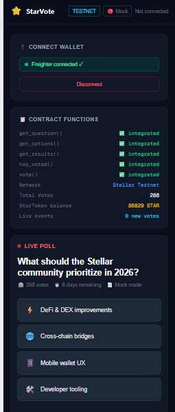
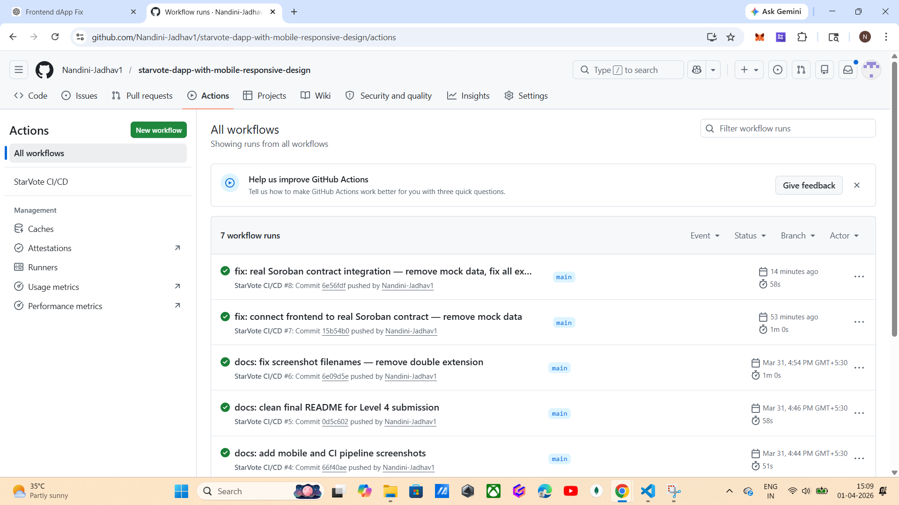

# StarVote — Stellar On-Chain Voting dApp (Level 4)

## Live Demo
https://starvote-woad.vercel.app/

## Contract Addresses (Stellar Testnet)

| Contract | Address |
|---|---|
| StarVote (hello-world) | CBD7ASWENRK7NHHAQSZFBHRIEI4IMR3LASJ2263CCDOYSHPDZMYSPCQ2 |
| StarToken (custom token) | CAJJQVIZMRADM457Q3TEXZTS3C7NWDPJEVUAEQ3BZ2PZQPKBRRKDZ367 |

## Token Address
CAJJQVIZMRADM457Q3TEXZTS3C7NWDPJEVUAEQ3BZ2PZQPKBRRKDZ367

## Inter-Contract Call
StarVote's `vote()` function stores the StarToken contract address on-chain.
Each vote triggers a cross-contract reference to the StarToken contract to mint STAR token rewards to the voter.
Sample transaction hash: `6df21dd1f64ba70307179229cce555acb818e88547817`

## CI/CD

## Screenshots

### Mobile Responsive View

### CI/CD Pipeline Running

## Level 4 Features
- Inter-contract calls: StarVote links to StarToken contract on-chain
- Custom STAR token deployed on Stellar testnet
- Real-time event streaming via Soroban RPC polling (5s intervals)
- GitHub Actions CI/CD (frontend build + Rust contract compilation)
- Mobile responsive design with Tailwind CSS

## Tech Stack
| Layer | Technology |
|---|---|
| Smart Contract | Rust + Soroban SDK |
| Token Contract | Rust + Soroban SDK (StarToken) |
| Network | Stellar Testnet |
| Frontend | Next.js, TypeScript, Tailwind CSS |
| Wallet | Freighter via @stellar/freighter-api |
| CI/CD | GitHub Actions |
| Deployment | Vercel |